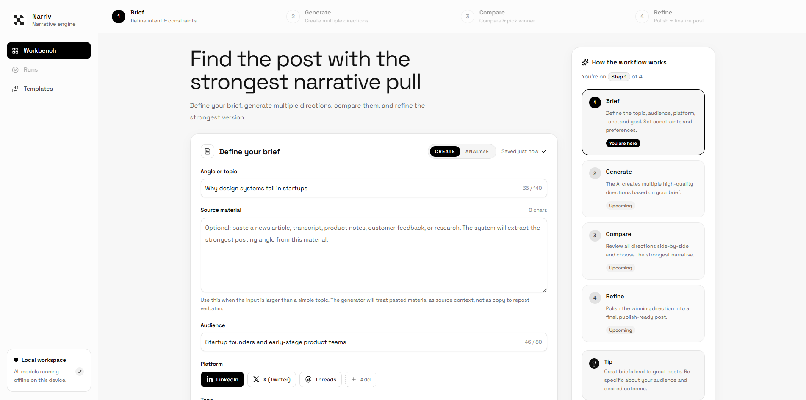

# Narriv

Narriv is a local workbench for drafting and comparing social posts. It generates a few candidate posts, scores them with a local TribeV2 worker, and can run a refinement pass on the best candidate.

This is an alpha project. Treat the scores as research signals for structure, pacing, and relative draft quality. They are not proof that a post will perform well in the real world.

## Screenshot



## Status

- Stage: experimental alpha
- Target setup: Windows 11 local development with a separate worker environment
- Primary workflow: `Brief -> Generate -> Score -> Compare -> Refine`

## What it does

- Generate multiple post variants from a short brief
- Use long-form source material such as articles, notes, or transcripts
- Score drafts locally with TribeV2-derived features
- Compare draft momentum and sentence-level contribution
- Refine the strongest candidate
- Write readable run logs to `data/run_logs`

## Architecture

```text
apps/
  api/         FastAPI orchestration layer
  worker/      FastAPI local TribeV2 scoring worker
  web/         Next.js frontend
packages/
  schemas/     Shared Pydantic request/response models
  scoring/     Deterministic ranking and feature logic
docs/
  scoring-method.md
  setup-windows-wsl2.md
data/
  run_logs/    Text logs for optimize, score-only, and refine runs
```

## How it works

- OpenAI handles candidate generation and refinement through the Responses API.
- TribeV2 runs locally and returns temporal and vertex-level response data.
- Narriv turns those raw outputs into product-facing metrics such as hook strength, sustained momentum, and end strength.
- Final ranking blends the Tribe-derived features with platform fit, readability, novelty, and constraint compliance.

## Claims to avoid

Narriv uses experimental brain-inspired scoring. Be precise when describing it.

Acceptable wording:

- predicted brain-response-based scoring
- brain-inspired ranking
- experimental cognitive-response analysis

Do not call it:

- guaranteed virality
- conversion prediction
- direct attention measurement
- real-world engagement prediction

## Requirements

### Required

- Windows 11 or similar local dev environment
- Python 3.11+
- Node.js 20+
- a local clone of TribeV2, with `TRIBE_REPO_PATH` pointing to that clone

### Recommended

- NVIDIA GPU with CUDA-enabled PyTorch in the worker environment
- Hugging Face authentication for gated model dependencies

### External dependencies

- OpenAI API access for real generation/refinement
- Hugging Face access for TribeV2 model/runtime dependencies

Without `OPENAI_API_KEY`, Narriv can fall back to mock LLM output for UI and plumbing tests.

## Quick start

### 1. Clone the repo

```powershell
git clone <your-repo-url> narriv
cd narriv
```

### 2. Copy environment templates

```powershell
Copy-Item .env.example .env
Copy-Item apps\web\.env.example apps\web\.env.local
```

### 3. Create the API environment

```powershell
python -m venv .venv-api
.\.venv-api\Scripts\Activate.ps1
pip install -r requirements-api.txt
deactivate
```

### 4. Create the worker environment

```powershell
python -m venv .venv-worker
.\.venv-worker\Scripts\Activate.ps1
pip install -r requirements-worker.txt
deactivate
```

### 5. Install the web app dependencies

```powershell
cd apps\web
npm install
cd ..\..
```

### 6. Start the app

#### Option A: launcher script

```powershell
.\start_narriv.bat
```

`start_narriv.bat` starts the local services.

#### Option B: manual startup

Worker:

```powershell
.\.venv-worker\Scripts\python -m uvicorn apps.worker.app.main:app --host 127.0.0.1 --port 8001
```

API:

```powershell
.\.venv-api\Scripts\python -m uvicorn apps.api.app.main:app --host 127.0.0.1 --port 8000
```

Web:

```powershell
cd apps\web
npm run dev
```

### 7. Open the app

- Web: [http://127.0.0.1:3000](http://127.0.0.1:3000)
- API health: [http://127.0.0.1:8000/health](http://127.0.0.1:8000/health)
- Worker health: [http://127.0.0.1:8001/health](http://127.0.0.1:8001/health)

## Main workflows

### Generate and optimize

`POST /optimize`

Example:

```json
{
  "topic": "Why design systems fail in startups",
  "source_material": "",
  "platform": "linkedin",
  "audience": "startup founders",
  "goal": "thought leadership",
  "tone": "confident and clear",
  "constraints": {
    "max_chars": 600,
    "include_cta": true
  },
  "candidate_count": 4,
  "refine_winner": true
}
```

### Score one or two pasted drafts directly

`POST /optimize/score`

### Refine a chosen draft

`POST /refine`

## Long-form input

Narriv supports two distinct generation inputs:

- `topic`: a short angle, headline, or brief
- `source_material`: a larger block of text such as an article, transcript, or research notes

When `source_material` is present, Narriv uses it as grounding context. It is not meant to be reposted verbatim.

## Run logs

Successful runs write `.txt` logs to:

```text
data/run_logs/
```

Each log includes:

- request summary
- constraints
- recommended candidate
- explanation
- per-candidate score breakdown
- sentence features
- source material when applicable

## Environment variables

See:

- [`.env.example`](./.env.example)
- [`apps/web/.env.example`](./apps/web/.env.example)

Important notes:

- Do not set a shared `APP_NAME` in the root `.env`. Both API and worker currently read the same file.
- `OPENAI_API_KEY` is optional only if you are using mock mode.
- `OPENAI_MODEL` defaults to `gpt-5.4`; `OPENAI_FALLBACK_MODEL` is tried after repeated 429 responses.
- `HF_TOKEN` and/or `huggingface-cli login` are typically required for real TribeV2 text inference.

## Limitations

- The project is alpha quality.
- Setup is not one-click on a clean machine yet.
- The worker environment is sensitive to PyTorch/CUDA compatibility.
- TribeV2 text inference can be slow, especially without GPU.
- Some TribeV2 dependencies and model assets may require gated access.
- Brain-inspired ranking is not the same thing as real platform performance prediction.
- Cross-platform setup has not been validated.

## Public description

Use this framing for public descriptions:

`Narriv: an experimental open-source narrative-scoring workbench for social post generation and comparison`

Do not describe it as a finished publishing optimizer.

## Development notes

- API config: [`apps/api/app/config.py`](./apps/api/app/config.py)
- Worker config: [`apps/worker/app/config.py`](./apps/worker/app/config.py)
- Shared models: [`packages/schemas/brainopt/models.py`](./packages/schemas/brainopt/models.py)
- Ranking logic: `packages/scoring`
- Frontend app: `apps/web`

## License

This repository's code is licensed under the MIT License. See [LICENSE](./LICENSE).

- That license applies to this repository's code, not to third-party model weights or external services.
- TribeV2 usage has separate licensing constraints.
- OpenAI API usage is subject to OpenAI terms.

Read [docs/license-and-dependency-notes.md](./docs/license-and-dependency-notes.md) before public release or commercial use.

